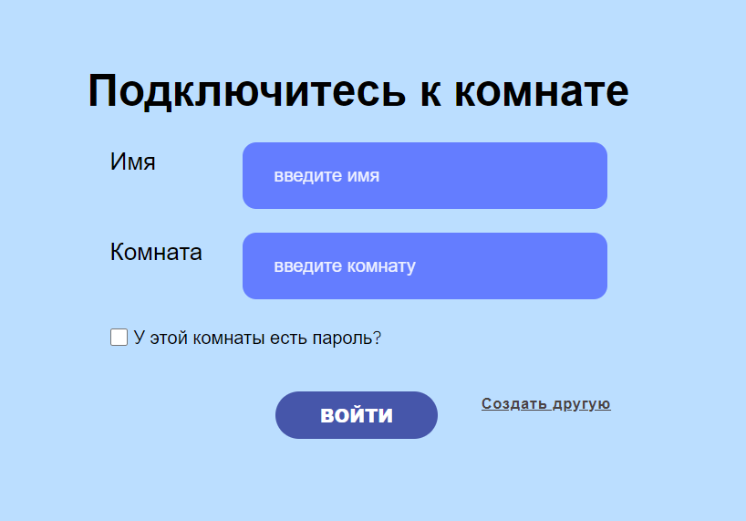
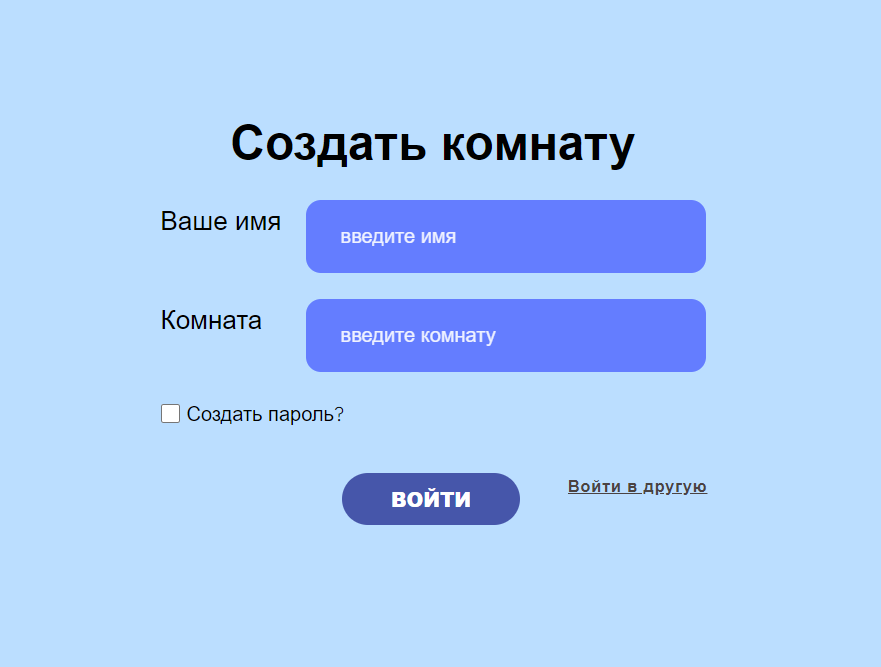
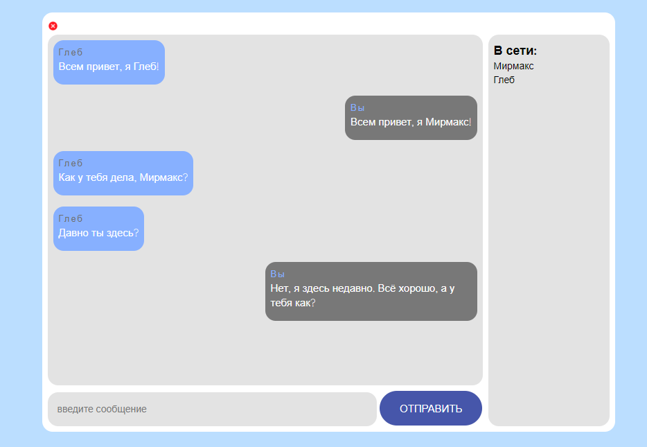

#Чат на WebSockets
___
##Описание

Чат работает на WebSocket с использованием библиотеки Ratchet. 
Имеется возможность создавать свою комнату и поставить на 
неё пароль или же просто оставить открытой. Когда пользователь 
пытается зайти в комнату, которая находится под паролем, то ему выскакивает ошибка. 
Основные библиотеки: для подключения MySql библиотека Krugozor; 
для роутинга библиотека Slim; в качестве шаблонизатора библиотека Twig;

##Маршруты и обзор
+ https://chat/
  
+ https://chat/store
  
+ https://chat/main/chat
  